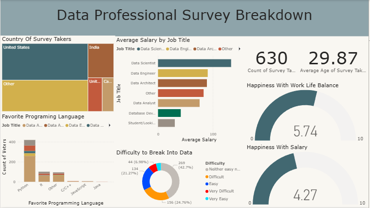
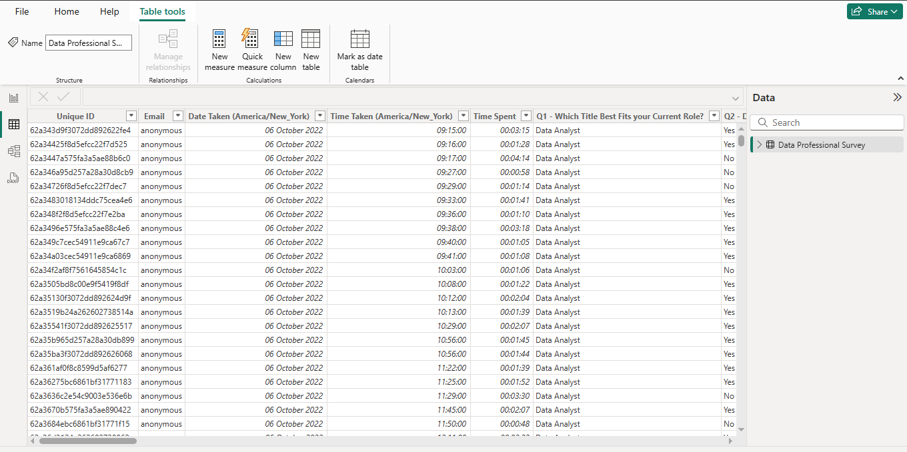

# 📊 Data Professional Survey Visualization (Power BI)

Proyek ini merupakan bagian dari **pelatihan Data Analyst bersama Alex The Analyst**.  
Analisis dilakukan menggunakan **Power BI** dengan dataset hasil survei komunitas profesional data dari berbagai negara dan peran pekerjaan.

---

## 📂 Sumber & Referensi

- **🎓 Pelatihan (YouTube Playlist)**  
  [Data Analyst Bootcamp – Alex The Analyst](https://www.youtube.com/playlist?list=PLUaB-1hjhk8FE_XZ87vPPSfHqb6OcM0cF)

- **📁 Dataset (GitHub)**  
  [Power BI – Final Project Dataset (Excel)](https://github.com/AlexTheAnalyst/Power-BI/blob/main/Power%20BI%20-%20Final%20Project.xlsx)

---

## 🎯 Tujuan Analisis

1. Memetakan distribusi responden berdasarkan **negara** dan **jabatan pekerjaan**.  
2. Menganalisis **rentang gaji** di berbagai peran profesional data.  
3. Menilai hubungan antara **tingkat kebahagiaan**, **keseimbangan kerja-hidup**, dan **gaji**.  
4. Mengidentifikasi **bahasa pemrograman favorit** di kalangan profesional data.  

---

## 🛠 Tools yang Digunakan

| Tools | Fungsi |
|-------|---------|
| **Power BI** | Visualisasi data & pembuatan dashboard interaktif |
| **Excel / CSV** | Pengelolaan dan pembersihan dataset awal |

---

## 📈 Insight yang Ditemukan

1.  **Data Sains** menjadi profesi data yang memiliki rata-rata gaji tertinggi disusul oleh data enginering diurutan ke dua.  
2.  **Python** menjadi bahasa pemrograman terfavorit untuk profesi data dan **R** menjadi bahasa pemrograman ke dua.
3.   **Profesi data** menurut responden tidak mudah dan tidak sulit yang berada pada zona abu-abu sebanyak 269 responden atau 42,7% menyatakanya.

---

## 📸 Preview Visualisasi

  
  

---

## 📜 Lisensi

Proyek ini dibuat **untuk tujuan pembelajaran** dan **tidak memiliki afiliasi resmi** dengan pihak manapun.  
Seluruh data bersumber dari proyek pelatihan publik milik [Alex The Analyst](https://www.youtube.com/@AlexTheAnalyst).
